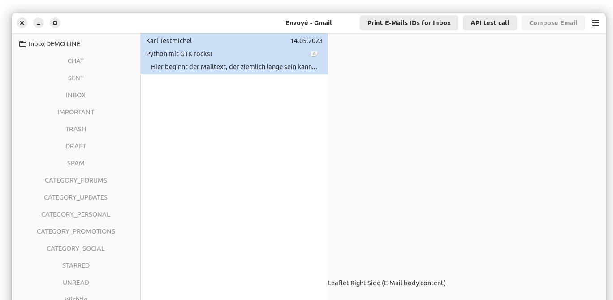

# Envoye

Gmail client for Linux (GTK4). Uses Gmail API instead of IMAP to better interface with Gmail specific implementations (most importantly the labels system).

## Frameworks and Libraries used

- GTK
- Adwaita
- PyGObject
- [Google API Python client library](https://github.com/googleapis/google-api-python-client)

## Requirements

- Linux environment (preferably GTK-based)
- [GNOME Builder](https://developer.gnome.org/documentation/introduction/builder.html)
- Python 3
- [Blueprint compiler for GTK](https://jwestman.pages.gitlab.gnome.org/blueprint-compiler/index.html)
- Client secrets for Google Cloud project for Google OAuth (contact repository owner)

## Development Setup (Under construction...)

- Clone Repository locally
- Put *credentials.json* file in home folder of current user (/~) - (WIP - should be loaded from project)
- Open project folder in GNOME builder and click "Run"
- => should build the project automatically
- Dependencies are provided via JSON file in project root, should be installed automatically by Meson
- Running the app for the first time opens a browser window
- Authorise access to Gmail account via Google OAuth

## Pre-built packages

- available as Flatpak (WIP)

## Working protoype functionality

- display user labels
- load list of emails for label